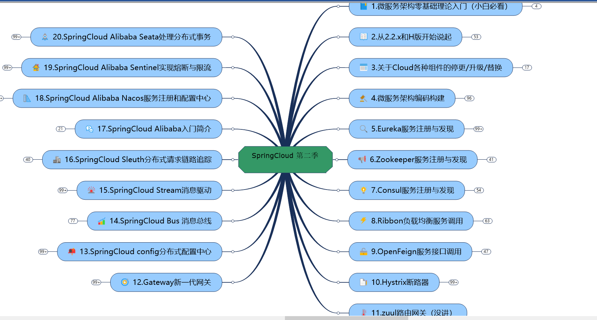
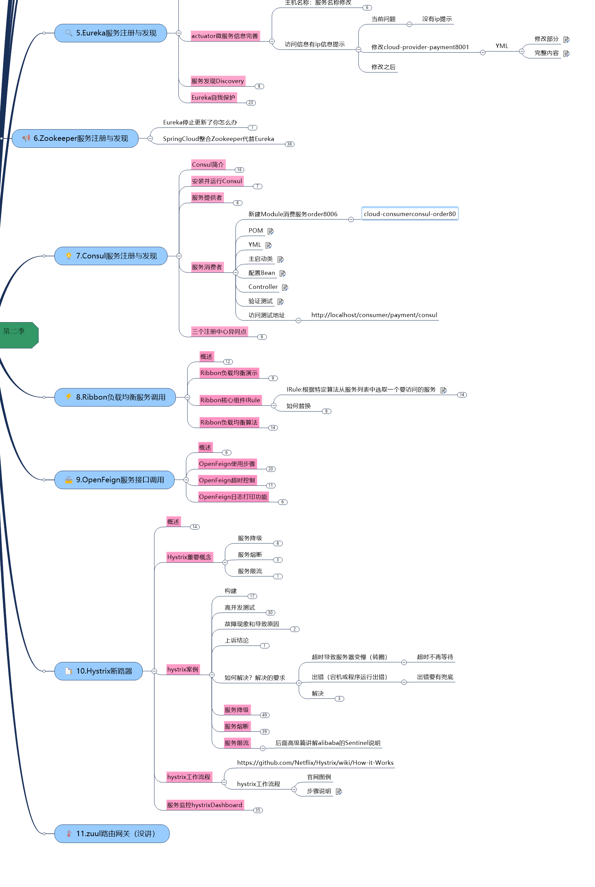
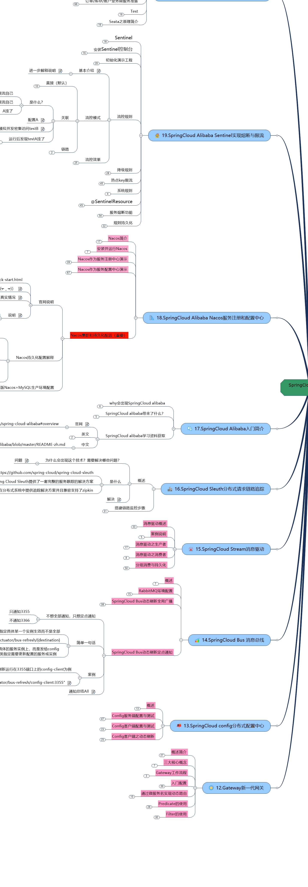

# 环境

- [x] IDEA开启RUN DASHBOARD

- [x] 热部署端口警告
- [x] **cloud和boot版本约束（官网）**

# 依赖

+ apache-zookeeper-3.5.8-bin.tar.gz
+ consul.exe
+ consul_1.8.3_windows_amd64.zip
+ JetbrainsCrack.jar
+ nacos-server-1.1.4.tar.gz
+ nacos-server-1.1.4.zip
+ otp_win64_21.3.exe
+ rabbitmq-server-3.7.14.exe
+ seata-server-0.9.0.zip
+ seata-server-1.0.0.zip
+ sentinel-dashboard-1.7.1.jar
+ tesseract-ocr-setup-4.00.00dev.exe
+ zipkin-server-2.12.9-exec.jar

# 参考

**SpringCloud 第二季2020.03.05.mmap**

